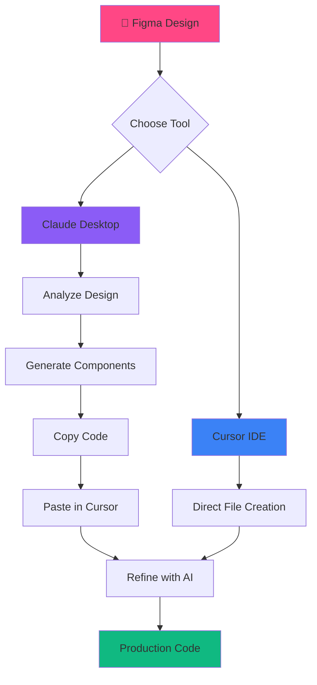

# 🎨 Figma to Code Workflow Diagram

## 🔄 The Complete Workflow



## 📊 Detailed Process Flow

### Phase 1: Design Analysis (Claude Desktop)
```
┌─────────────────┐
│  Figma Design   │
│   (URL/Link)    │
└────────┬────────┘
         │
         ▼
┌─────────────────┐
│ Claude Desktop  │
│   + Figma MCP   │
└────────┬────────┘
         │
         ▼
┌─────────────────┐
│ AI Analysis:    │
│ • Components    │
│ • Layout        │
│ • Colors        │
│ • Spacing       │
└────────┬────────┘
         │
         ▼
┌─────────────────┐
│ Generated Code: │
│ • React         │
│ • TypeScript    │
│ • Tailwind      │
└─────────────────┘
```

### Phase 2: Implementation (Cursor)
```
┌─────────────────┐
│ Generated Code  │
│ (from Claude)   │
└────────┬────────┘
         │
         ▼
┌─────────────────┐
│   Cursor IDE    │
│  @workspace     │
└────────┬────────┘
         │
         ▼
┌─────────────────┐
│ Direct Editing: │
│ • Create files  │
│ • Refactor      │
│ • Add features  │
└────────┬────────┘
         │
         ▼
┌─────────────────┐
│Production Ready │
│     Code        │
└─────────────────┘
```

## 🎯 Decision Matrix

```
When to use Claude Desktop:
✅ Initial design analysis
✅ Understanding design system
✅ Complex component relationships
✅ Explaining design decisions
✅ Generating from scratch

When to use Cursor:
✅ Direct file manipulation
✅ Code refactoring
✅ Adding to existing code
✅ Running/testing code
✅ Git operations
```

## ⚡ Quick Decision Tree

```
Start Here
    │
    ▼
Is it a new design?
    │
    ├─ Yes → Use Claude Desktop first
    │         └→ Then Cursor for implementation
    │
    └─ No → Is it a code update?
            │
            ├─ Yes → Use Cursor directly
            │
            └─ No → Need design context?
                    │
                    ├─ Yes → Claude Desktop
                    │
                    └─ No → Cursor
```

## 🔧 Tool Capabilities

### Claude Desktop + Figma MCP
```
INPUT                    OUTPUT
─────────────────────    ─────────────────────
Figma URL          →     Component Structure
                   →     Design Tokens
                   →     Layout Analysis
                   →     Initial Code
                   →     Documentation
```

### Cursor + AI
```
INPUT                    OUTPUT  
─────────────────────    ─────────────────────
Code/Instructions  →     Direct File Changes
                   →     Refactored Code
                   →     New Features
                   →     Bug Fixes
                   →     Tests
```

## 🚀 Optimal Workflow

```
1. ANALYZE (Claude Desktop)
   ├─ "What's in this design?"
   ├─ "What components do I need?"
   └─ "Generate initial code"

2. IMPLEMENT (Cursor)
   ├─ "@workspace create components/"
   ├─ "Add to existing files"
   └─ "Integrate with app"

3. REFINE (Both)
   ├─ Claude: "How should this animate?"
   ├─ Cursor: "Implement the animation"
   └─ Iterate until perfect
```

## 📈 Time Savings

```
Traditional Workflow:
Figma → Manual Inspection → Code → Debug → Refine
Time: 3-4 hours per component

AI Workflow:
Figma → Claude Analysis → Generated Code → Cursor Refine
Time: 15-30 minutes per component

Efficiency Gain: 85-92% ⚡
```

---

*This is what the future of development looks like - where design and code merge seamlessly through AI understanding.*
